# IoT Stream Engine: High-Performance Ingestion Platform


A high-throughput, event-driven IoT ingestion engine designed to handle massive concurrency with low latency. Built with FastAPI, Kafka, and Postgres.

## 🏗️ Architecture

```mermaid
graph LR
    Sensors[📱 IoT Sensors] --> |HTTP/JSON| LB[⚖️ Load Balancer]
    LB --> API[🚀 FastAPI Engine]
    API -- Check Limit --> Redis[🔴 Redis Cache]
    API -- Produce Event --> Kafka[📨 Kafka Stream]
    Kafka --> Worker[👷 Async Worker]
    Worker --> DB[🐘 Postgres DB]
```



## 🚀 Key Features

*   **Event-Driven Architecture**: Decouples ingestion from persistence using Kafka, allowing for practically instant API responses (`202 Accepted`).
*   **High-Performance**: Optimized for concurrent I/O with `uvicorn` and `aiohttp`.
*   **Rate Limiting**: specific Redis-backed rate limiting to protect against DDoS and sensor malfunction.
*   **Docker & K8s Ready**: Fully containerized with `docker-compose` for easy orchestration.
*   **Scalable**: Stateless API consumers and independent workers allow for horizontal scaling.

## 🛠️ How to Run

### Prerequisites
*   Docker & Docker Compose
*   Python 3.11+ (for load testing)

### Start the System
```bash
docker-compose up --build
```
This spins up the Engine, Worker, Kafka, Zookeeper, Redis, and Postgres.

### Run Load Tests
To verify performance, install dependencies and run the included load tester:
```bash
pip install aiohttp
python scripts/load_tester.py
```

## 📊 Benchmarks

We rigorously benchmarked the system to ensure it meets high-scale demands.

| Stage | RPS | Latency | Notes |
|-------|-----|---------|-------|
| **Initial Sync API** | 88 RPS | High (>2s) | Bottlenecked by synchronous DB writes. |
| **Optimized Config** | 135 RPS | Medium | Improved by removing logs & tuning Docker. |
| **Event-Driven** | **154+ RPS** | **Low (<0.5s)** | **75% Improvement**. Decoupled via Kafka. |

*Benchmarks run with 500 concurrent simulated devices on a standard dev environment.*

---
© 2026 IoT Stream Engine Team
